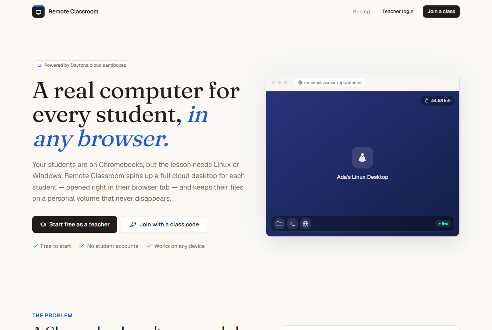
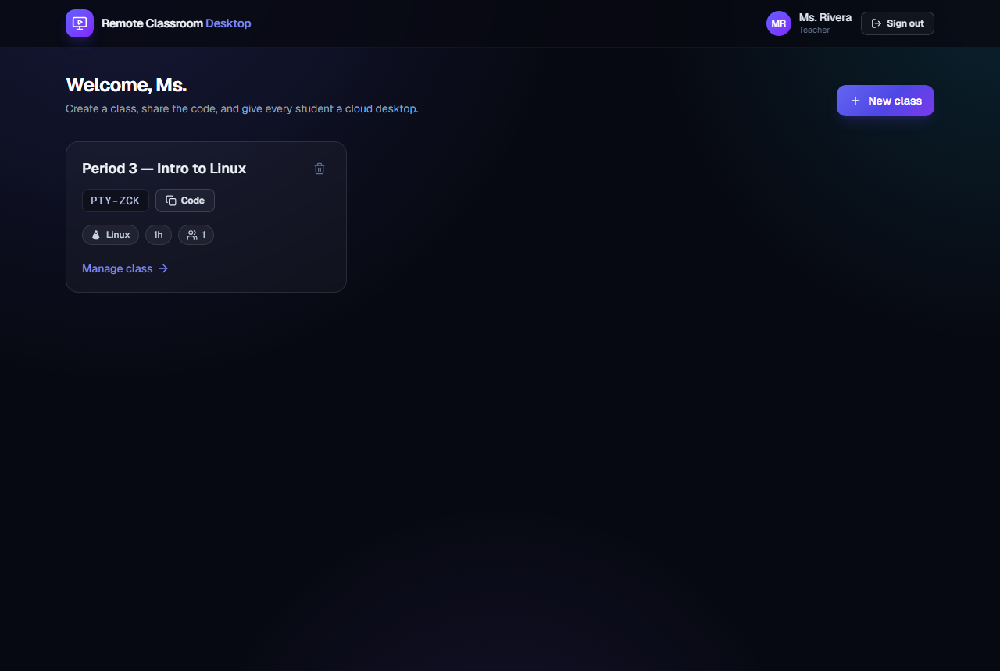
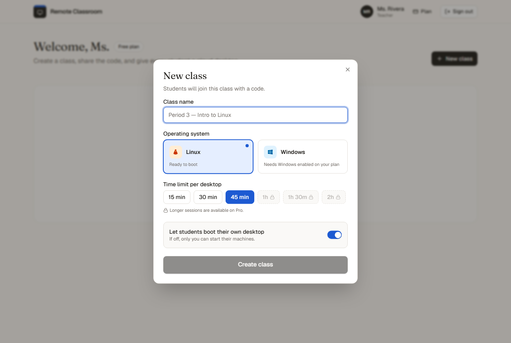
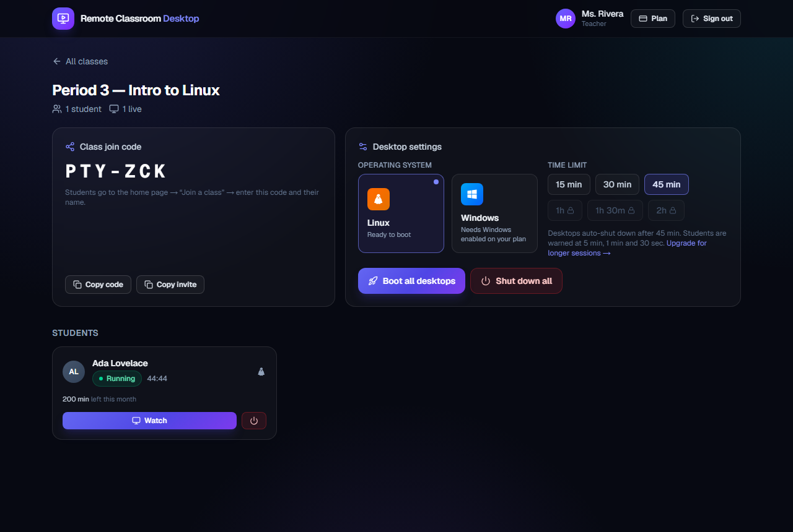
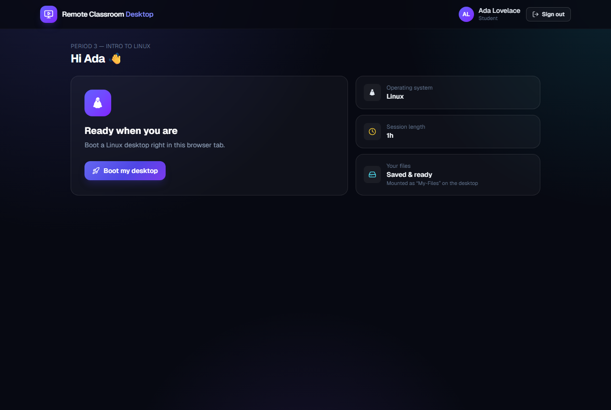
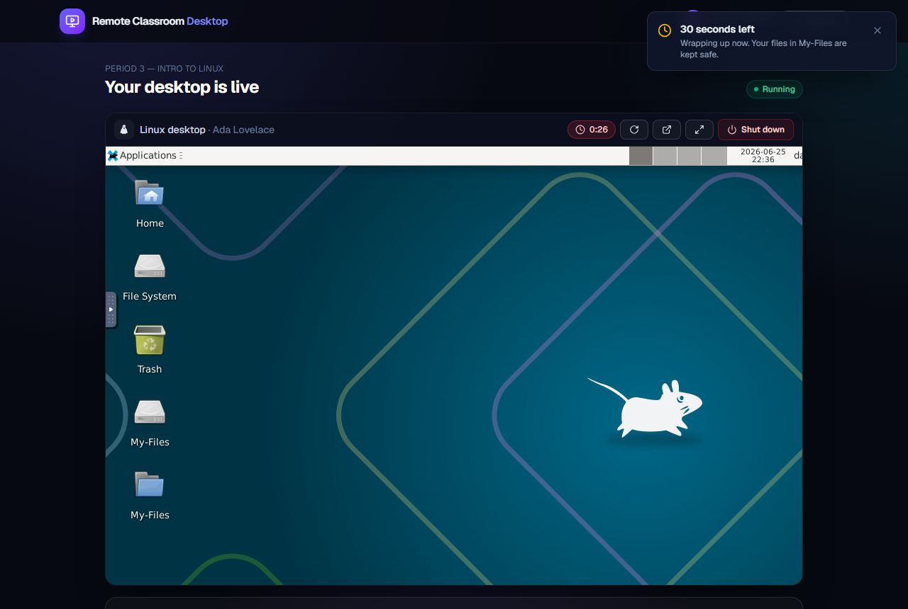
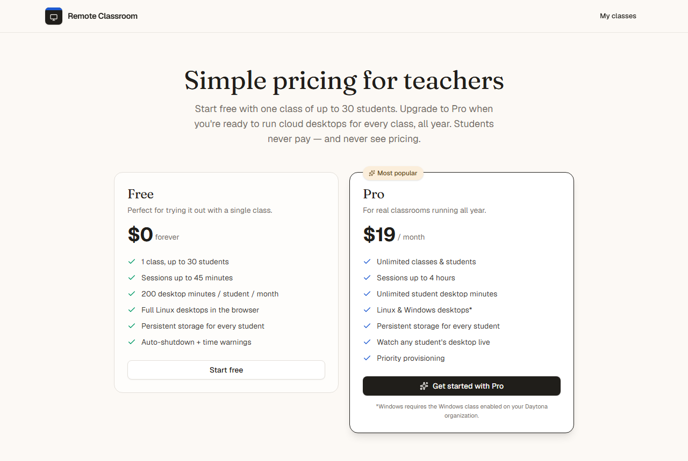
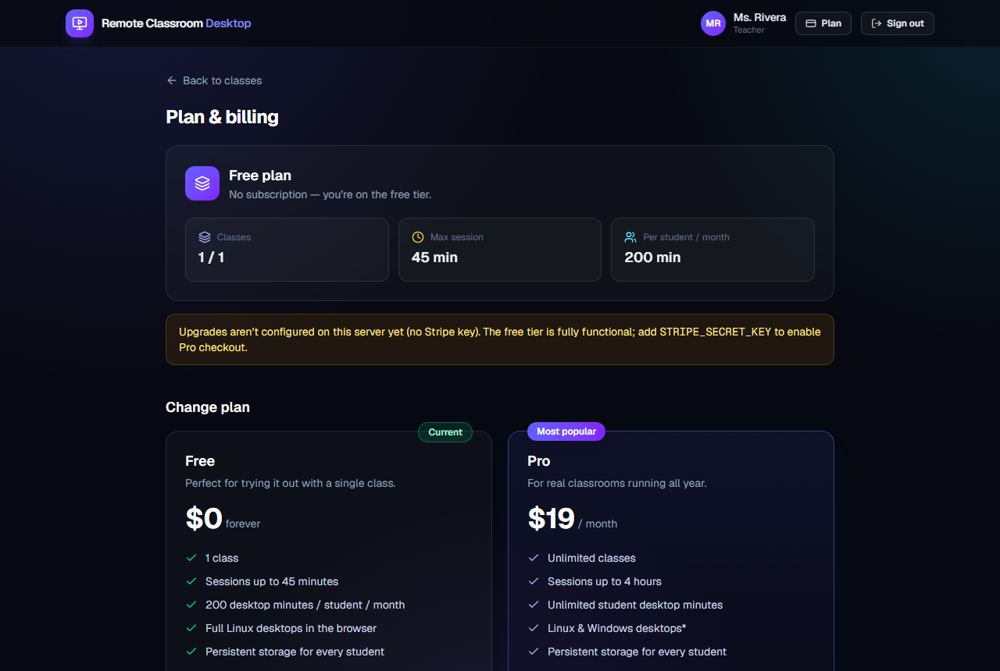

# Remote Classroom Desktop

**Give every student a real Linux or Windows desktop — right inside their browser. No matter what device they're on.**

Remote Classroom Desktop is a Google-Classroom-style web app for teachers who need their students on a real operating system, but whose students only have Chromebooks (or iPads, or whatever the school could afford). Teachers create a class, share a join code, and with one click boot a full cloud desktop for every student. Each student gets their own machine **and** a personal storage volume that keeps their files forever — even after the machine is destroyed.

It's powered by [Daytona](https://www.daytona.io/docs/en/), which provisions the actual desktops on demand and streams them to the browser over noVNC.

<p align="center">
  
</p>

---

## The problem this solves

Schools hand out **Chromebooks** because they're cheap, locked-down, and easy to manage at scale. That's great — until a class actually needs a *computer*:

- A programming class needs a **Linux terminal**, a compiler, Docker, VS Code.
- A CTE or design class needs **Windows-only software**.
- A networking or security class needs **root** and a sandbox they can safely break.

A Chromebook can't run any of that. The traditional answer is a **computer lab**: buy 30 machines, image them, patch them, repair them, and replace them every few years. It's expensive, it doesn't travel home, and it's a maintenance nightmare.

### The solution: rent the computer by the minute

Instead of *owning* hardware, Remote Classroom Desktop **rents it on demand** from Daytona:

1. The teacher picks an OS (**Linux** or **Windows**) and a time limit.
2. Daytona spins up a real cloud sandbox running a full XFCE desktop with VNC.
3. The desktop is streamed into the student's browser tab — so a $200 Chromebook becomes a window into any operating system.
4. When the timer ends, the machine is **torn down automatically** so nothing runs (and bills) longer than it should.
5. The student's files live on a **persistent volume** that's re-mounted next time, so their work is never lost.

No lab. No imaging. No drivers. No leftover machines burning money overnight.

---

## Demo

| Teacher dashboard | Create a class |
|---|---|
|  |  |

| Class command center | Student boots a desktop |
|---|---|
|  |  |

**A real Linux desktop, embedded in the browser — note the persistent `My-Files` folder:**


**Built-in time-limit warnings (5 min / 1 min / 30 sec) before the machine shuts down:**



**Pricing for teachers (students never see this) and a self-serve billing page powered by Stripe:**

| Pricing | Billing |
|---|---|
|  |  |

---

## Features

- 🎓 **Teacher accounts** — sign up with email + password in seconds.
- 🔑 **Class codes** — students join with a code and their name, just like Google Classroom. No accounts to provision.
- 🖥️ **Linux & Windows** — choose the OS per class. (Linux works out of the box; see [OS support](#operating-system-support).)
- 🚀 **Boot the whole class at once, or let students self-serve** — one click provisions a desktop for every enrolled student; students can also boot their own.
- 💾 **Persistent per-student storage** — each student's files are mounted as `My-Files` on the desktop and survive machine restarts.
- ⏱️ **Time limits + auto-shutdown** — set a duration; machines are torn down automatically when it expires. A server-side sweeper enforces it even if no one's watching, and Daytona's inactivity auto-stop is a second safety net.
- 🔔 **Countdown + warnings** — students see a live timer and get **5-minute, 1-minute and 30-second** warnings (in-app toasts + native browser notifications).
- 👀 **Teacher visibility** — teachers see every machine in the class and can watch any student's live desktop; students only ever see their own.
- 🧱 **Live monitor wall** — one tab shows every running desktop as a live, view-only tile (lazy-mounted noVNC streams); click any tile to expand and take control. Lets a teacher watch the whole class at a glance.
- 📁 **Volume file browser** — teachers browse (and download from) any student's `My-Files` volume; students browse their own. Reads the running sandbox's filesystem with path-traversal-safe, per-machine authorization.
- 🧼 **No scary interstitials** — the desktop is proxied same-origin so Daytona's public-preview warning page never reaches students.
- 💳 **Plans & Stripe billing** — a Free tier and a Pro tier with limits enforced across the app. Teachers upgrade via Stripe Checkout and manage their subscription in the Stripe customer portal. **Students never see pricing.**

---

## Plans &amp; pricing

Pricing is shown to teachers only — students join with a code and never encounter a paywall.

| | **Free** | **Pro — $19/mo** |
|---|---|---|
| Classes | 1 | Unlimited |
| Students per class | 30 | Unlimited |
| Max session length | 45 minutes | 4 hours |
| Desktop minutes / student / month | 200 | Unlimited |
| Linux desktops | ✅ | ✅ |
| Windows desktops | — | ✅* |
| Persistent storage | ✅ | ✅ |
| Watch students live | ✅ | ✅ |

Limits are enforced server-side: class creation is blocked past the cap, session length is clamped to the plan's maximum (longer options are visibly locked in the UI), and each student's monthly desktop-minutes are metered as their machines run. When a student is out of minutes they see a neutral *"out of time this month"* message — never an upsell.

Billing is **optional**: the Free tier works with no Stripe configuration. Set `STRIPE_SECRET_KEY` (and `STRIPE_WEBHOOK_SECRET`) to enable Pro upgrades. The checkout uses inline price data, so no Stripe dashboard product setup is required.

*\*Windows requires the Windows class enabled on your Daytona organization.*

---

## How it works

```
Browser (student/teacher)
        │  HTTPS + WebSocket (same origin)
        ▼
Next.js app  ──────────────►  Postgres   (teachers, classes, students, machines)
   │  server.mjs reverse-proxies /desktop/* to Daytona,
   │  injecting X-Daytona-Skip-Preview-Warning
   ▼
Daytona  ──►  Sandbox (XFCE + noVNC desktop on :6080)
              + persistent Volume mounted at ~/Desktop/My-Files
```

- **Provisioning** (`src/lib/machines.ts`, `src/lib/daytona.ts`): when a desktop is booted, the app gets/creates the student's volume, waits for it to be `ready`, creates a Daytona sandbox from the desktop snapshot with the volume mounted, starts the computer-use processes (`Xvfb`, `xfce4`, `x11vnc`, `novnc`), and stores the preview URL. The machine row moves `PROVISIONING → RUNNING`.
- **The desktop proxy** (`server.mjs`): Daytona shows a one-time security interstitial for public preview links. We avoid it entirely by routing the noVNC page, its assets, and the VNC WebSocket through our own origin (`/desktop/<host>/...`) and injecting the documented `X-Daytona-Skip-Preview-Warning: true` header on every upstream request. The proxy only forwards to validated `*.daytona*` hosts (not an open proxy), and **every request and WebSocket upgrade is authenticated**: it verifies the `rcd_session` JWT and authorizes the caller against that specific sandbox (the owning student, or the teacher of that student's class) before forwarding, with a short in-memory authz cache. Sandbox hosts are only ever disclosed in-app to those same authorized users.
- **Time limits**: every machine has an `expiresAt`. The client renders a live countdown and fires warnings as it crosses 5 min / 1 min / 30 sec. A 30-second in-process **sweeper** (`src/lib/sweeper.ts`, started from `src/instrumentation.ts`) tears down any expired sandbox. There's also a `GET /api/cron/sweep` endpoint for external schedulers in serverless deployments.
- **Persistence**: each student maps to a named Daytona volume mounted at `~/Desktop/My-Files`. The sandbox (compute) is ephemeral and deleted on stop; the volume (files) persists and is re-mounted on the next boot.

### Roles & data model

`Teacher → Classroom (joinCode) → Student → Machine`, plus a per-student persistent `Volume`. Sessions are signed JWTs in an httpOnly cookie. Teachers authenticate with a password; students authenticate by knowing the class code (their name is their identity within the class).

---

## Operating system support

| OS | Status |
|---|---|
| **Linux** (Ubuntu + XFCE) | ✅ Fully working out of the box. |
| **Windows** | ⚠️ Selectable in the UI and fully wired up, but Daytona gates the `windows` sandbox class behind an organization/plan entitlement. Until it's enabled on your Daytona org, booting Windows returns a clear message: *"Windows is not enabled on your Daytona organization yet."* The moment your org is entitled, it works with no code changes. |

> macOS is intentionally not offered (no licensed cloud-macOS path), so the UI exposes **Linux and Windows** only, as scoped.

---

## Tech stack

- **Next.js 16** (App Router, React 19, TypeScript) on a small custom Node server (`server.mjs`) for the desktop reverse-proxy.
- **Tailwind CSS v4** + **shadcn/ui** (Radix primitives) with a custom "Chalk & Cobalt" editorial theme (warm paper, cobalt accent, Fraunces display serif) and **sonner** for toasts.
- **Prisma 6 + PostgreSQL** for data.
- **Daytona TypeScript SDK** (`@daytonaio/sdk`) for sandboxes, volumes, and preview links.
- **Stripe** for subscriptions (Checkout + customer portal + webhooks).
- **jose** (JWT sessions) + **bcryptjs** (password hashing) + **zod** (validation).

---

## Getting started

### Prerequisites

- Node.js 20+
- Docker (for local Postgres)
- A [Daytona](https://app.daytona.io) account + API key

### 1. Clone & install

```bash
git clone https://github.com/<you>/remote-classroom-desktop.git
cd remote-classroom-desktop
npm install
```

### 2. Configure environment

```bash
cp .env.example .env
```

Edit `.env` and set your `DAYTONA_API_KEY` and a random `JWT_SECRET`. (See `.env.example` for all options.)

### 3. Start Postgres

```bash
docker run -d --name rcd-postgres \
  -e POSTGRES_PASSWORD=postgres \
  -e POSTGRES_DB=remote_classroom \
  -p 5544:5432 postgres:16-alpine
```

### 4. Apply the database schema

```bash
npx prisma migrate dev
```

### 5. Run it

```bash
npm run dev
```

Open http://localhost:3000 — sign up as a teacher, create a class, then open the join page in another browser/incognito window to join as a student.

For a production build:

```bash
npm run build
npm start   # runs the custom server (server.mjs)
```

### Enabling Pro upgrades (optional)

The Free tier works with no extra setup. To enable Stripe checkout:

1. Add your test keys to `.env`:
   ```bash
   STRIPE_SECRET_KEY="sk_test_..."
   STRIPE_WEBHOOK_SECRET="whsec_..."   # from `stripe listen`
   ```
2. Forward webhooks locally with the [Stripe CLI](https://docs.stripe.com/stripe-cli):
   ```bash
   stripe listen --forward-to localhost:3000/api/billing/webhook
   ```
3. Restart the app. Teachers can now upgrade from **Plan &amp; billing**; subscription
   changes flow back through the webhook and flip the teacher's plan automatically.

---

## Cleaning up

Desktops are deleted automatically when their timer expires, when a teacher hits **Shut down all**, or when a student shuts down. To remove the local database, stop and delete the Postgres container:

```bash
docker rm -f rcd-postgres
```

---

## Security notes

- `DAYTONA_API_KEY` and `JWT_SECRET` live only in `.env` (gitignored) and are used server-side only.
- The `/desktop` reverse-proxy validates that the target hostname is a Daytona preview host before forwarding, so it can't be abused as an open proxy.
- Student auth is intentionally lightweight (class code + name), matching the Google-Classroom model. For higher-stakes deployments, add a per-student PIN.

---

## License

MIT — see [LICENSE](LICENSE).

---

*Built as a demonstration of using Daytona to make any operating system available to any student, on any device.*
